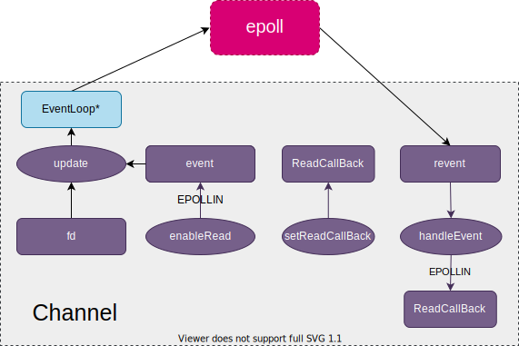
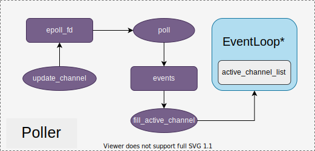

# 1 简介

muduo是基于Reactor模式的多线程C++网络库，采用非阻塞 IO 模型，基于事件驱动和回调，原生支持多核多线程，适合编写高性能 Linux 服务端多线程网络应用程序。通过源码阅读，梳理代码设计，不依赖于boost，实现muduo库的C++重构。  

> **核心内容：**
>
> - 阻塞、非阻塞、同步、异步
> - Linux 5中I/O模型、epoll优势
> - Reactor模型
> - 基于事件驱动和事件回调的epoll+线程池面向对象编程
> - socket编程
> - 多线程开发
> - C++优秀代码段

# 2 压力测试

## 2.1 测试机器

客户端：Windows10，Intel(R) Core(TM) i5-7300HQ CPU @ 2.50GHz，核心4；

服务端：Ubuntu 18.04，Intel(R) Xeon(R) Gold 5118 CPU @ 2.30GHz，核心数12；

## 2.2 测试软件

jmeter，线程组500，循环100次，共50000样本；

## 2.3 测试结果

| Label     | 样本  | 平均值 | 中位数 | 最小值 | 最大值 | 异常% | 吞吐量 | 接收KB/sec |
| --------- | ----- | ------ | ------ | ------ | ------ | ----- | ------ | ---------- |
| TCP取样器 | 50000 | 105    | 96     | 18     | 1354   | 0.0   | 4050.9 | 2484.3     |

# 3 整体设计

## 3.1 设计理念

muduo服务端网络库采用one loop per thread设计，即在单线程实现高效的网络服务，对于N核服务器只需要启动N个线程，即可使多核服务器提供高效的网络服务；将整个设计分为两个子任务：

- 在单线程中设计高效的事件驱动模型（单线程实现高效的网络服务）；
- 多个线程运行多个事件驱动的负载均衡设计（有机融合多个单线程事件驱动模型）；

> 前者在单线程中实现高效的事件循环；后者通过轮询，将新注册的事件和回调高效分发到N个线程的事件循环中去。

## 3.2 单线程的高效网络服务

muduo采用Reactor实现事件驱动，其中，事件循环是Reactor的核心，采用epoll模型实现；

> epoll模型此处指IO复用和非阻塞IO结合，二者相辅相成：
>
> - IO复用避免非阻塞IO需要轮询检查IO操作造成的CPU资源浪费；
> - 非阻塞IO避免read、write、accept等操作阻塞线程，导致IO复用中的其他socket上的IO事件无法执行；



## 3.3 多线程的高效网络服务

每个线程运行一个高效的事件循环，根据服务器核数，启动多个线程，实现多线程的高效网络服务。muduo设计一系列功能组件实现多个单线程事件循环的有机组合。

**整体架构图**


**主要组件**

- Channel：对文件描述符fd封装，记录一个fd上的事件和事件回调；在Reactor模型中充当Event和EventHandle的角色；
- EventLoop：向epoll注册监听事件、启动事件循环、取发生事件并执行事件回调，在Reactor模型中充当Reactor反应堆的角色；BaseEventLoop负责Acceptor Channel上的事件和事件回调，SubEventLoop负责TcpConnect Channel上的事件和事件回调；
- Acceptor：是服务器端listen socketfd的封装，可以理解为Acceptor Channel。与Channel定位一致，充当Event和EventHandle的角色；其中，Acceptor Channel负责的事件指客户端（clientfd）接入事件，事件回调是指获取与客户端连接的服务器端conn socketfd（进一步封装为TcpConnect Channel），轮询一个subEventLoop，将TcpConnect Channel分发到subEventLoop上；
- TcpConnect：是conn socketfd的封装，可以理解为TcpConnect Channel，conn socketfd在服务端，与client socketfd构成TCP连接。TcpConnect Channel负责的事件回调便是应用的业务逻辑，由用户提供。
- EventLoopThreadPool：EventLoopThread绑定一个EventLoop和一个线程，保障一个线程中有且仅有一个事件循环，EventThreadPool是对线程池的封装，由指定数目的EventLoopThread组成；
- TcpServer：一个TcpServer表示一个提供网络服务的应用，用户根据业务定义事件回调从而获取相应的网络服务，TcpServer中通过start方法启动应用；

**运行流程**

1. 用户根据业务需求，定义事件回调，并根据setServerCallBack注册到TcpServer;
2. TcpServer设置运行的线程数，对于N核服务器，使用1个线程负责BaseEventLoop事件循环，使用N-1个线程组成事件循环线程池EventLoopThreadPool，线程池中每个线程负责一个subEventLoop事件循环；
3. 配置服务TcpServer Address，启动TcpServer，Acceptor Channel创建listenfd（linux socket api），并通过updateChannel将listenfd读事件（epoll_event）和读事件回调newConnection注册（EPOLL_CTL_ADD）到BaseEventLoop事件循环，并启动监听（epoll_wait）；subEventLoop同样启动监听，但subEventLoop初始没有注册事件；
4. 客户端连接（linux connect api）TcpServer，触发listenfd读事件，epoll_wait返回对应epoll_event，通过set_events方法更新Acceptor Channel，BaseEventLoop根据Acceptor Channel上发生的事件类型执行对应回调，即handleRead；
5. Acceptor Channel handleRead首先获取与客户端连接的connfd（linux accept api），并调用之前注册的读事件回调中执行newConnection；newConnection将connfd封装成TcpConnection Channel，通过setConnCallback设置事件回调（用户定义的事件回调->TcpServer->TcpConnection Channel）；
6. Acceptor Channel handleRead通过getNextLoop轮询选择一个subEventLoop，将TcpConnection Channel分配到该subEventLoop，进一步通过runInLoop方法启动对TcpConnection Channel的读事件监听（EPOLL_CTL_ADD），至此基于subEventLoop上的epoll实现对一条tcp连接的服务端读事件监听；
7. 客户端向服务端发送数据后，对应connfd的tcp读缓冲区有了数据，触发connfd读事件，subEventLoop上epoll_wait返回epoll_event，并更新到TcpConnection Channel，subEventLoop执行读事件回调handleRead，handleRead中执行之前注册的onMessageCallback实现业务逻辑，至此完成多线程的高效网络服务通信。

# 4 组件设计

## 4.1 Channel

### 4.1.1 描述

Channel是对描述符fd的封装，在Reactor模型中充当Event和EventHandle的角色。



### 4.1.2 功能

1. setReadCallBack注册读事件回调；
2. enableRead注册读事件，并记录在event成员变量；

> 读事件：EPOLLIN | EPOLLPRI ，EPOLLPRI指带外数据；
>
> 写事件：EPOLLOUT
>
> 关闭事件：EPOLLHUP) & !EPOLLIN
>
> 错误事件：EPOLLERR

3. 通过epoll_ctl接口将fd和待监听事件event注册到epoll;

> EPOLL_CTL_DEL：删除fd上的事件
>
> EPOLL_CTL_MOD：修改fd上的事件
>
> EPOLL_CTL_ADD：增加fd上的事件

4. 当fd上有读事件发生时，epoll_wait接口返回epoll_event，通过epoll_event设置revent
5. channel根据revent上的事件执行对应回调函数；

### 4.1.3 关键

1. channel如何把fd上对应的事件注册到epoll上的？

> channel作为事件和事件回调，本身不具备注册功能，完全按照Reactor模型设计，事件->事件所对应的反应堆->事件发生器，channel->EventLoop->epoll，进而调用epoll的epoll_ctl方法注册事件；

2. epoll如何获取发生事件所对应的fd？如何获取所在在fd的channel?

> epoll_event提供data.ptr，可用于保存对象的指针，实现event和channel的绑定；
>
> epoll_event必须进行清零操作★★★
>
> ```
> epoll_event event;
> bzero(&event, sizeof event);
> event.events = channel->events();
> event.data.fd = fd; 
> event.data.ptr = channel;
> ```

## 4.2 Poller

### 4.2.1 描述

poller是在Reactor模型中充当事件分发器的角色，核心是IO复用+非阻塞IO模型，可以是select/poll/epoll。



### 4.2.2 功能

1. 创建epoll：通过epoll_create1接口创建epoll对象，向Linux内核中申请一个简易的文件系统，返回文件系统的句柄epoll_fd

> 文件系统采用B+树，磁盘IO消耗低，效率高

2. 注册事件：在updateChannel方法中，创建epoll_event事件对象，将channel记录的event传递给epoll_event，将channel对象地址保存在epoll_event.data.ptr上；通过epoll_ctl接口向epoll注册套接字；
3. 监听：在poll方法中，通过epoll_wait开启事件监听，将发生的事件保存在events事件vector中；

> events数组初始大小是16，若发生事件数量完全等于存储事件的数组容量，则对数组进行2倍扩容；由于epoll采用LT模式，未处理的事件会持续上报，因此事件不会丢失；

4. 处理事件：在fill_activte_channel方法中，从返回的events中获取Channel，具体事件更新在Channel的revent中，并将发生事件的Channel记录在EventLoop的active_channel_list中，进一步通过channel执行回调；

>关键代码如下：
>
>```
>for (int i=0; i < numEvents; ++i)                                   # 遍历发生的事件
>{
>    Channel *channel = static_cast<Channel*>(events_[i].data.ptr);  # 取channel
>    channel->set_revents(events_[i].events);                        # 将发生的事件记录在channel的revent成员变量
>    activeChannels->push_back(channel);                             # 记录待执行handleEvent的Channel
>}
>```

## 4.3 EventLoop

### 4.3.1 描述

EventLoop在Reactor模型中作为reactor反应堆角色，用于启动事件循环、执行事件回调等功能；

### 4.3.2 功能

EventLoop的成员方法loop运行在所绑定的线程中，loop会循环执行两类函数，一类是active Channel的handleEvent，一类是保存在doFunctors中的回调函数；前者由update成员方法注册到epoll文件系统上，后者由runInLoop或queueInLoop添加到doFunctors；

### 4.3.3 关键设计

1. 如何保证Channel handleEvent运行在规定的线程上？

> EventLoop是线程目标函数的局部变量，EventLoop的loop成员方法是线程目标函数内启动运行的，因此loop一定运行在规定线程上；Channel handleEvent是在loop中调用，因此handleEvent一定运行在规定线程上；

2. 如何让一个回调函数运行在指定的线程上？

> EventLoop和线程绑定，向EventLoop的成员变量中添加回调函数，那回调函数自然与线程绑定；

3. 如何触发doFunctors上回调函数的执行？

> 回调函数高效执行由两部分设计组成：
>
> ①使用eventfd接口创建的事件描述符，并封装为wakeupChannel注册读事件到epoll，当有新的functor需要执行时，向wakeupChannel写一个int_64即可接触epoll_wait阻塞，从而顺利执行functor;
>
> ②执行doFunctors上functor时，先采用局部变量对doFunctors进行缓存，避免执行doFunctors过程中无法添加新的functor而导致阻塞；

# 5 代码设计

记录muduo开源库中良好的代码设计。

## 5.1 从基类获取子类对象

### 5.1.1 场景

EventLoop绑定一个事件分发器，事件分发器有select、poll、epoll三种，如何封装？

### 5.1.2 设计



方案一：EventLoop上实现成员方法new_poller根据环境变量等参数配置创建select、poll、epoll中的一种，其中select、poll、epoll继承自Poller基类

> **缺点：**EventLoop.h需要引入select、poll、epoll对应头文件，其次select、poll、epoll选择逻辑代码放在EventLoop.h不符合面向对象中单一职责原则

方案二：将new_poller方法作为静态方法在Poller上实现，由Poller根据环境变量等参数配置选择创建select、poll、epoll中的一种；静态方法是因为

> **优点：**EventLoop.h直接调用Poller的new_poller方法即可绑定一个多路事件分发器，而不负责多路事件分发器的种类；
>
> **缺点：**Poller作为select、poll、epoll基类，不应在基类中引入子类的头文件，否则子类引用基类，基类引用子类，代码易发生混乱；

方案三：Poller中声明new_poller静态方法，但new_poller定义在一个新的文件default_poller.cc，此时Poller无需引用子类头文件；在default_poller.cc同时引用基类Poller头文件和子类select、poll、epoll头文件，负责具体多路事件发生器种类的选择和对象创建

> 优点：EventLoop.h直接调用Poller的new_poller方法即可绑定一个多路事件分发器，而不负责多路事件分发器的种类；且代码低耦合；

## 5.2 更灵活的线程类

Linux thread库在创建线程对象同时会立即启动线程，并且启动后立即返回，在使用过程中不易控制，因此对thread库进行二次封装，补充以下功能：

1. 控制线程启动的时刻；

2. 提供线程同步功能，确保线程执行状态；

> 例如线程中执行的是启动某一个服务，启动需要耗时；由于pthread创建线程对象后是立即返回，此时直接连接服务，可能无法确保服务启动完成而出现连接失败，因此，通过添加信号同步功能，确保线程中服务启动完成，再解除阻塞，进行后续操作。

```cpp
class Thread
{
public:
    using ThreadFunc = std::function<void()>;

    explicit Thread(ThreadFunc, const std::string &name = std::string())
    {
        sem_t sem;
        sem_init(&sem, false, 0);

        // 开启线程
        thread_ = std::shared_ptr<std::thread>(new std::thread([&](){
            do_something_before_start();
            sem_post(&sem);
            func_();      //在新线程中执行该线程函数
        }));

        // 必须等待do_something_before_start执行完成
        sem_wait(&sem);
    }
    
    ~Thread();

    void start();
	void do_something_before_start();  // 执行目标函数前，可以执行一些初始化操作
    
private:
    std::shared_ptr<std::thread> thread_;
    ThreadFunc func_;
}
```

## 5.3 线程中单例

### 5.3.1 场景

在一个线程中有且仅有一个对象实例，例如在一个线程中只能有一个事件循环EventLoop;

### 5.3.2 设计

1. 在线程中创建对象

```C++
std::shared_ptr<thread> t(std::bind(&EventLoopThread::threadFunc, this));

//将loop_设置为线程目标函数的局部变量，此时可确保对象在线程中，且退出时可自动执行析构。
void EventLoopThread::threadFunc()
{
    EventLoop loop_;
}
```

2. 线程单例检查

```C++
// __thread类型和类构造函数组合实现线程单例检查
extern __thread EventLoop t_loop_ = nullptr; //线程独立，此处使用extern声明全局变量，被多个其他文件包含不会出现重定义；

class EventLoop
{
    EventLoop()
    {
        if(t_loop_ !=nullptr)
        {
            exit(EXIT_FAILURE);
        }
    }
}
```

## 5.4 缓存线程ID

```cpp
#include <unistd.h>
#include <sys/syscall.h>

namespace CurrentThread
{
    extern __thread int t_cachedTid; // 线程独立，此处使用extern声明全局变量，被多个其他文件包含不会出现重定义；

    void cacheTid()
    {
        if (t_cachedTid == 0)
        {
            // 通过linux系统调用，获取当前线程的tid值
            t_cachedTid = static_cast<pid_t>(::syscall(SYS_gettid));
        }
    }

    inline int tid()
    {
        /*
        GCC在编译过程中，会将可能性更大的代码紧跟着前面的代码，从而减少指令跳转带来的性能上的下降, 达到优化程序的目的。

        if (__builtin_expect(t_cachedTid == 0, 0))语句逻辑等于if(t_cachedTid == 0)
        但__builtin_expect(t_cachedTid == 0, 0)表示t_cachedTid == 0为false(0)的期望更大，因此执行cacheTid()的可能性小；缓存只在第一次获取时调用cacheTid()，自然可能性小；提前告诉编译器，优化程序；
        */
        if (__builtin_expect(t_cachedTid == 0, 0))
        {
            cacheTid();
        }
        return t_cachedTid;
    }
}
```

## 5.5 用户态通信

eventfd可以实现用户态间的通信，可以被epoll监听；evenfd类似于unix本地socket，不会经过tcp协议栈处理，性能上非常高效。

```cpp
// 创建eventfd
int evtfd = ::eventfd(0, EFD_NONBLOCK | EFD_CLOEXEC);

// 读，多次写仅需要读一次即可清零
uint64_t one = 1;
ssize_t n = read(wakeupFd_, &one, sizeof one);

// 写，可多次写，相当于累加器，每写一次，进行一次累加计数
uint64_t one = 1;
ssize_t n = write(wakeupFd_, &one, sizeof one);
```

## 5.6 控制多个对象的构造和赋值

```cpp
class noncopyable
{
public:
    noncopyable(const noncopyable&) = delete;
    noncopyable& operator=(const noncopyable&) = delete;
protected:
    noncopyable() = default;
    ~noncopyable() = default;
};

// noncopyable被继承后，派生类对象可以正常的构造和析构，但是派生类对象,无法进行拷贝构造和赋值操作
class B: noncopyable 
```

## 5.7 日志系统设计

1. 采用静态方法+静态成员变量实现日志对象的单例模式
2. #define+do while的组合使用，用于宏定义多行，单独花括号在if else语句中易发生逻辑错误；
3. `##__VA_ARGS__`捕获可变参数...，当...为空时，`##__VA_ARGS`__可以去除逗号，以保证程序可以编译执行

```c++
#define LOG_ERROR(logmsgFormat, ...)                      \
    do                                                    \
    {                                                     \
        Logger &logger = Logger::instance();              \
        logger.setLogLevel(ERROR);                        \
        char buf[1024] = {0};                             \
        snprintf(buf, 1024, logmsgFormat, ##__VA_ARGS__); \
        logger.log(buf);                                  \
    } while (0)
    
    
enum LogLevel
{
    INFO,  // 普通信息
    ERROR, // 错误信息
    FATAL, // core信息
    DEBUG, // 调试信息
};

// 输出一个日志类
class Logger: noncopyable
{
public:
    static Logger &instance() // 获取日志唯一的实例对象, 单例模式
    {
        static Logger logger;
    	return logger;
    }
    void setLogLevel(int level); // 设置日志级别
    void log(std::string msg); // 写日志

private:
    int logLevel_;
};
```

## 5.8 OOP封装实现事件回调

事件回调，OOP封装的一种形式

```cpp
// 复合带有回调成员变量的对象指针
class TcpServer:
{
public:	
    TcpServer()
    {
        acceptor_->setnewConnectionCallBack(bind(&TcpServer::newConnection,this))
    }
    
	void newConnection();
private:
	Acceptor* acceptor_;
}


// 提供回调函数成员变量和设置回调函数的成员方法，当触发事件，从而到达handleRead时，顺利执行回调函数
class Acceptor:
{
public:
    using NewConnectionCallback = function<void()>;
    
    void setnewConnectionCallBack(NewConnectionCallback cb){newConnectionCallback_ = cb;}
    
    void handleRead()
    {
        newConnectionCallback_();
    }
private:
    NewConnectionCallback newConnectionCallback_;
}
```
## 5.9 [scoket编程](./notebook/socket.md)

## 5.10 [多线程开发](./notebook/multiThread.md)

